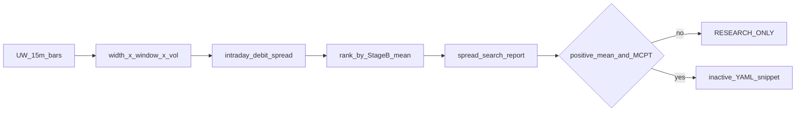

# Plan — Spread × window edge search (post-Friday rules)

Author: Cursor plan for implement. Date: 2026-07-17.
Status: DONE

## Where we left off


| Experiment                         | Result                                                                               |
| ---------------------------------- | ------------------------------------------------------------------------------------ |
| Entry-time buckets                 | All negative; **am** least bad (−1.3%), close worst                                  |
| Naked vs debit_spread (w=2, close) | Spread **−0.28%** vs naked **−3.18%** — still RESEARCH ONLY                          |
| Live RH history                    | Expiration/Friday wipeouts; size discipline → **Friday flatten shipped** (`75840ea`) |
| Historical XSP fills               | Still blocked (no tape)                                                              |


Spreads changed payoff geometry meaningfully. Next leverage is not another full entry-time grid or naked retune — it is **tune the spread** and **pair it with the better window**.

## Goal

Find whether any debit-spread cell under Nagus locks shows a **positive Stage B mean** (or clearly survives familywise MCPT) on strict UW 15m bars.

**Done when:**

1. CLI can sweep `width_strikes ∈ {1,2,3}` × windows `{am, close}` × volume `{vall, vq33}` under locked Nagus TP/SL/phased-SL/DTE30.
2. Strict UW report written under `reports/backtest/spread_search_*.{md,json}` with side-by-side leaders, `pricing_fidelity=modeled_bs_lite`, YAML `active: false`.
3. Fixture smoke + focused tests green; local commit (no `LIVE_*` flips).
4. Operator UW command documented.

## Design (concrete defaults)

Reuse existing Stage B path — do **not** invent a second engine.

- **Structure:** `debit_spread` only for search cells; include one `naked` close control cell for baseline.
- **Widths:** 1 / 2 / 3 strike steps (5 / 10 / 15 XSP points) via existing `debit_spread_width_strikes`.
- **Windows:** `am` (09:45–11:00) + `close` (15:45–16:00) — reuse knobs from `scripts/optimize_entry_time.py` / `intraday.py`.
- **Nagus locks:** DTE 30, ATM, regime OFF, TP 30%, SL 20% / early 10%×90m, hold=5.
- **Volume axis:** `vall` + `vq33` (same as yesterday).
- **Grid budget:** ≤ 16 cells (3 widths × 2 windows × 2 vol + 1 naked control + slack) — reject if over.
- **Friday flatten in backtest:** add the same Friday≥15:45 exit reason into Stage B `evaluate_exit_alerts` path already used by intraday (prod already has it in `lane_a_monitor.py`) so research matches the new ops rule. Close-window Friday entries that would open then instantly flatten should count as blocked/no-edge, not silent.

Prefer **new** `scripts/optimize_spread_search.py` (copy patterns from `optimize_structure.py` + window helpers from `optimize_entry_time.py`) to avoid regressing prior CLIs.



## Files

**Edit:**

- `xsp_killer/backtest/intraday.py` — ensure Friday flatten from LaneRules applies in Stage B (if not already wired through shared `evaluate_exit_alerts`)
- `xsp_killer/backtest/variants.py` — knobs already mostly present; only if width/window wiring gaps

**Create:**

- `scripts/optimize_spread_search.py`
- `tests/test_backtest_spread_search.py`
- `briefs/2026-07-17_spread-window-search-plan.md` (this plan’s tracked brief)

**Do not touch:** `LIVE_*`, place path, tipdrop secrets, activating variants.

## Parallel ops signal (no new strategy)

Keep paper soak accumulating **debit_spread_shadow** economics on real SPY→XSP proxy marks (already in `lane_a_entry.py`). No live place of spreads. This is forward evidence only — not a historical fill tape.

## Verification

```bash
PYTHONPATH=/opt/xsp-killer python3 -m pytest tests/test_backtest_spread_search.py -q
PYTHONPATH=/opt/xsp-killer python3 scripts/optimize_spread_search.py --mode fixture -v
export XSP_UW_TIPDROP_ROOT=/opt/tipdrop-scanner
PYTHONPATH=/opt/xsp-killer python3 scripts/optimize_spread_search.py --mode uw \
  --period 5y --intraday-period 60d --mcpt --out reports/backtest -v
```

## Hard constraints

- `LIVE_*` false; no promotion claims; never label `historical_xsp_chain`
- Local commit when green; push only if asked
- Implement via Grok CLI after plan approval (same pattern as entry-time / structure)

## Interpretation rule

If best cell mean still ≤ 0 → stop expanding BS-lite grids; next research becomes **paper-soak shadow spreads + RH Agentic fills once funded**, not more synthetic IV knobs.

## 7. Status

- [x] Plan written
- [x] Implemented (Friday Stage B veto + flatten notes; `optimize_spread_search.py`; tests)
- [x] Tests green (`tests/test_backtest_spread_search.py` + related Stage B suites)
- [x] Local commit
- [x] UW operator command documented

### Operator commands

```bash
# Offline fixture
PYTHONPATH=/opt/xsp-killer python3 scripts/optimize_spread_search.py --mode fixture -v

# Strict UW (Hetzner tipdrop)
export XSP_UW_TIPDROP_ROOT=/opt/tipdrop-scanner
PYTHONPATH=/opt/xsp-killer python3 scripts/optimize_spread_search.py --mode uw \
  --period 5y --intraday-period 60d --mcpt --out reports/backtest -v
```

Reports: `reports/backtest/spread_search_*.{json,md}` — always
`pricing_fidelity=modeled_bs_lite`, YAML `active: false`, RESEARCH ONLY.
Friday flatten + friday_no_entry apply in Stage B intraday path.
